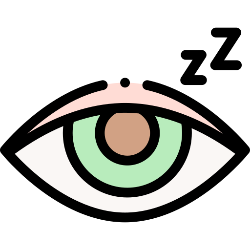
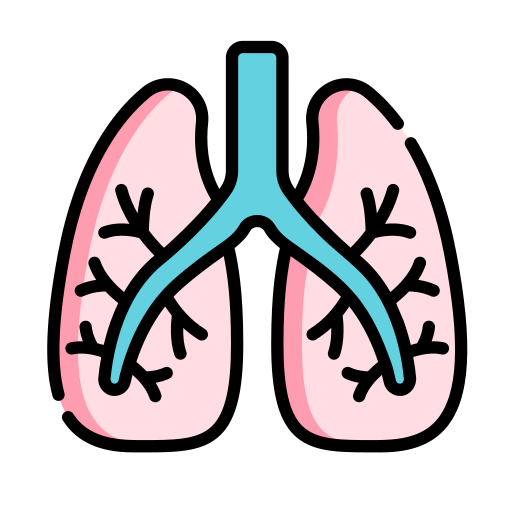
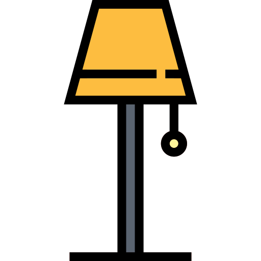
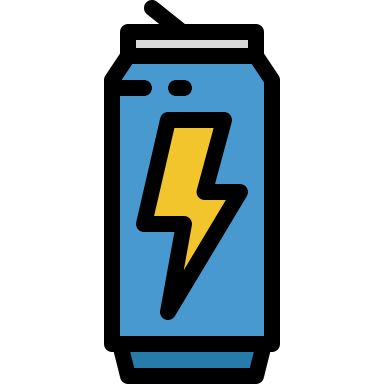

# HBN_EMA_NIMH
A test repo for HBN EMA applet with NIMH content.

Applet codebook found [here](https://bookdown.org/mikemxxiao/NIMH_Applet_Codebook/)
 
 

### Icon and images attribution

## Openmoji 
Most icons in this applet directly pulled or derived from [Openmoji 12.1](https://openmoji.org/). All emojis are free to use under the CC BY-SA 4.0 license.

 

## Flaticon

Icons made by <a href="https://www.flaticon.com/authors/freepik" title="Freepik">Freepik</a> from <a href="https://www.flaticon.com/" title="Flaticon">www.flaticon.com</a>

 

Icons made by <a href="https://www.flaticon.com/authors/pixel-perfect" title="Pixel perfect">Pixel perfect</a> from <a href="https://www.flaticon.com/" title="Flaticon"> www.flaticon.com</a>

 

Icons made by <a href="https://www.flaticon.com/authors/eucalyp" title="Eucalyp">Eucalyp</a> from <a href="https://www.flaticon.com/" title="Flaticon"> www.flaticon.com</a>

 

Icons made by <a href="https://www.flaticon.com/authors/smalllikeart" title="smalllikeart">smalllikeart</a> from <a href="https://www.flaticon.com/" title="Flaticon"> www.flaticon.com</a>

 

Icons made by <a href="https://www.flaticon.com/authors/smashicons" title="Smashicons">Smashicons</a> from <a href="https://www.flaticon.com/" title="Flaticon"> www.flaticon.com</a>

 

Icons made by <a href="https://www.flaticon.com/authors/photo3idea-studio" title="photo3idea_studio">photo3idea_studio</a> from <a href="https://www.flaticon.com/" title="Flaticon"> www.flaticon.com</a>

 

Icons made by <a href="https://www.flaticon.com/authors/monkik" title="monkik">monkik</a> from <a href="https://www.flaticon.com/" title="Flaticon"> www.flaticon.com</a>

